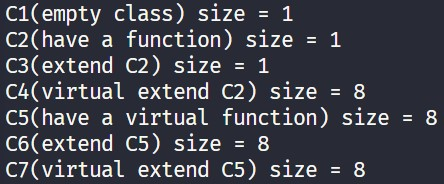

**源自快手面试，痛定思痛，决定重新深入学习一遍c++！**

# size of class

1. 空类大小
2. 带一个函数的类大小
3. 继承2的类的大小
4. 虚继承2的类的大小
5. 带一个虚函数的类的大小
6. 继承5的空类大小
7. 虚继承5的空类大小

```cpp
#include <iostream>

class C1
{
};

class C2
{
public:
    void func() {}
};

class C3 : C2
{
};

class C4 : virtual C2
{
};

class C5
{
public:
    virtual void vfunc() {}
};

class C6 : C5
{
};

class C7 : virtual C5
{
};

int main()
{
    std::cout << "C1(empty class) size = " << sizeof(C1) << std::endl;
    std::cout << "C2(have a function) size = " << sizeof(C2) << std::endl;
    std::cout << "C3(extend C2) size = " << sizeof(C3) << std::endl;
    std::cout << "C4(virtual extend C2) size = " << sizeof(C4) << std::endl;
    std::cout << "C5(have a virtual function) size = " << sizeof(C5) << std::endl;
    std::cout << "C6(extend C5) size = " << sizeof(C6) << std::endl;
    std::cout << "C7(virtual extend C5) size = " << sizeof(C7) << std::endl;
}
```

- 运行结果



- 分析

1. 空类1字节，默认占位。
2. 带一个函数的类，由于类的结构，类只拥有自身变量，函数为共有，故只需要1字节。
3. 继承2的类，无变化
4. 虚继承2的类，由于虚继承需要虚指针，故为一个指针大小，64位机器64位操作系统，故8字节。
5. 带一个虚函数的类，由于虚函数需要虚指针，故8字节。
6. 继承5的类，由于虚函数需要虚指针，故8字节。
7. 虚继承5的类，同4，故8字节。

# class default func

1. 默认构造函数
2. 默认析构函数
3. 默认拷贝构造函数
4. 默认赋值运算符
5. 默认取地址运算符
6. 默认const取地址运算符
7. 默认移动拷贝构造
8. 默认移动赋值

- 前四个需要重点掌握

```cpp
class Test
{
public:
    Test();
    ~Test();

    Test(const Test &);
    Test &operator=(const Test &);

    Test *operator&();
    Test const *operator&() const;

    Test(Test &&);
    Test &operator=(Test &&);
};
```

- 补充

    默认构造函数十分重要，因为类生成总是优先调用默认构造函数！故使用参数列表进行初始化非常必要，可以少一次函数调用！
    默认函数可以通过`=default`设置为默认，或者通过`=delete`设置为屏蔽。
