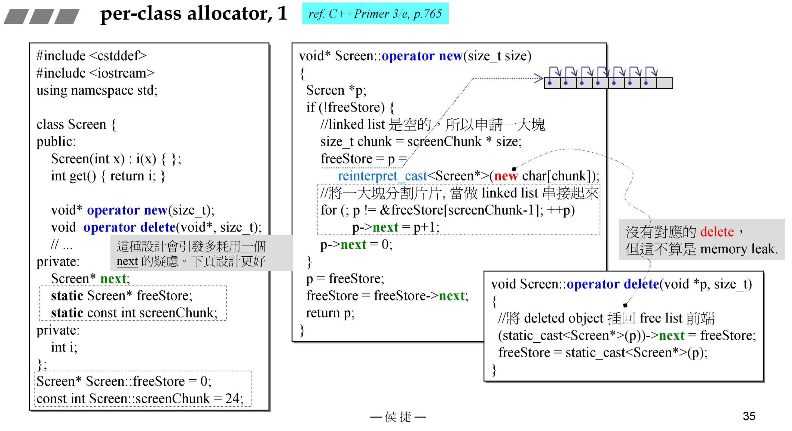
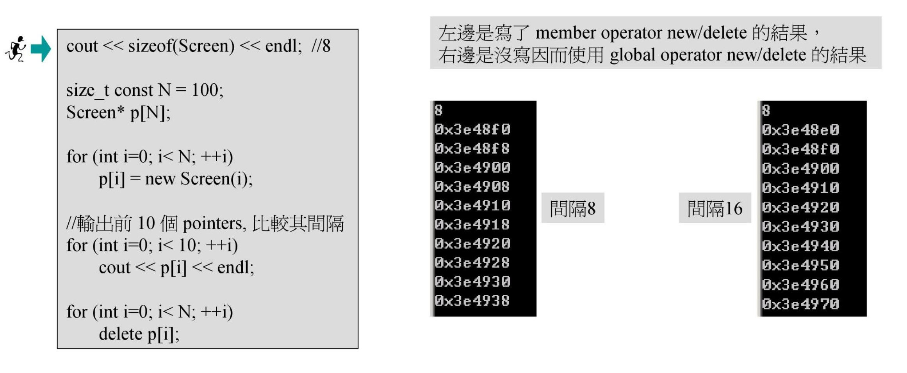
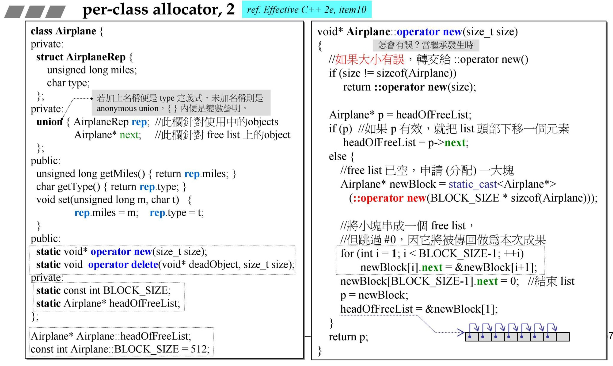
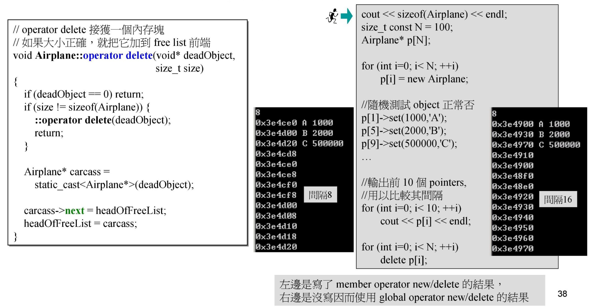

源自侯捷老师内存管理课程！

# class allocator

## pre-class allocator 1





这里的内存分配，与重载new()不同之处在于引入了一个next指针以构建类似内存池的思想，提前把后续需要的申请出来组成一个链表（观察代码可以发现其本质就是一个数组）。但是代价是每个对象增加了一个指针的空间消耗，以及不确定后续是否会全部使用造成的空间浪费。

这里我学习的时候走入了一个误区，定义类数组的时候去申请了空间，后面对类初始化的时候又去申请了空间。最开始我认为这里有矛盾，对一个类做了两次空间申请，所以就很好奇，此处类初始化的new难道不就是placement new吗？

其实并不是如此，还是基础知识不牢靠！**定义数组的本质是定义了一个指向该类型的指针的集合**，所以定义数组的时候申请的空间是一个指针数组，做类初始化的时候才真正调用new申请类的空间同时进行类的初始化。

验证如下：
```cpp
#include <bits/stdc++.h>

using namespace std;

class Test
{
public:
    Test()
    {
        cout << "Test()" << endl;
    }

    void *operator new(size_t size)
    {
        cout << "new" << endl;
        ::operator new(size);
    }

    string s = "string";
};

int main()
{

    Test *at[10];

    cout << "string size :" << sizeof(string) << endl;
    cout << "at size : " << sizeof(at) << endl;
    cout << "at[0] size : " << sizeof(at[0]) << endl;

    cout << at[9]->s << endl;
    at[0] = new Test();
    return 0;
}
```
运行结果：


分析结果可知，at是指针数组大小，at[0]是第一个指针的大小，string大小远大于前两者，故证明了上面的说法。

数组与指针的关系：

1. auto数组名得到的是指针类型，decltype数组名得到的是数组类型。

2. 自动对数组名进行处理，将其转换为指向第一个数组的指针。

3. 静态数组的本质就是指针集合。

此处会发现动态数组有一个好处就是会节省很多不必要的指针。

## pre-class allocator 2





第二种方式，利用了union使用embedded pointer，来避免第一种方法中引入指针造成的多余空间消耗。

embedded pointer的巧妙之处在于利用union一片内存给两个变量使用的特性，结合申请数组空间中间（虚假链表真数组）不需要指针的特点，临时借用了数据存储的空间先给指针使用来完成数组空间的申请，后续进行初始化之后又变回了具体的数据。充分利用申请空间与初始化分开的时间差，节省了指针带来的空间消耗。

依旧存在的问题：提前申请了空间，但是不一定会用满。中间删除元素，也不会释放空间，造成冗余浪费。
