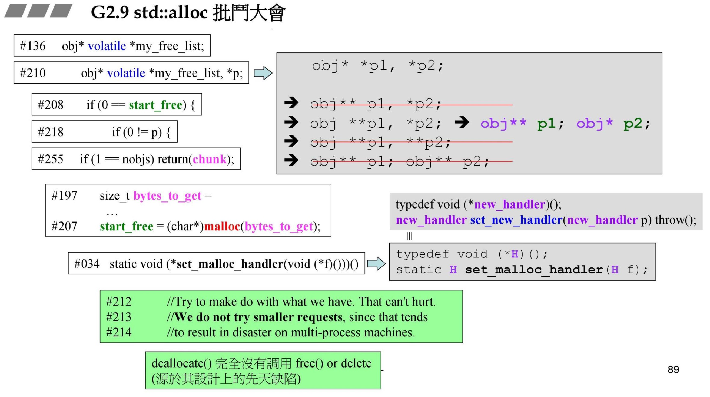
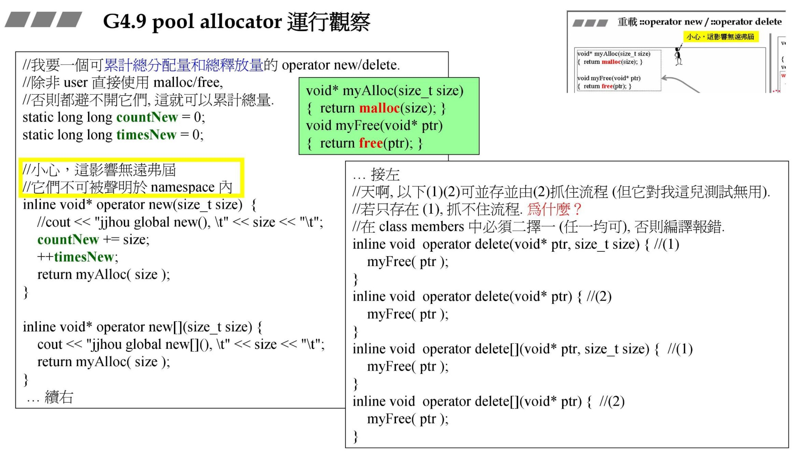
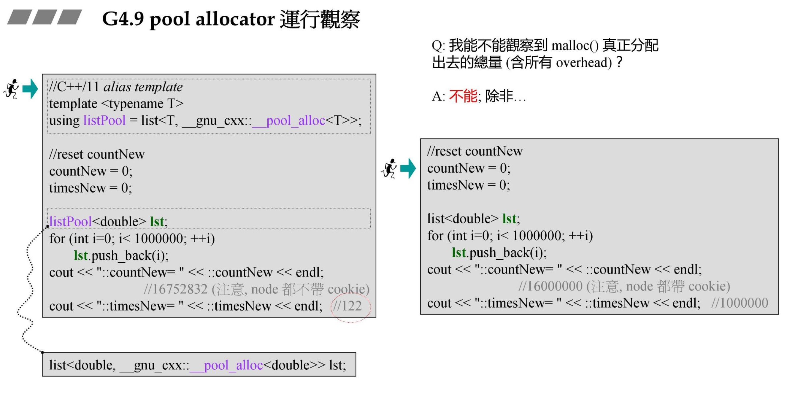

源自侯捷老师内存管理课程！

# std::alloc

## 代码风格

- 优秀的避免非语法bug的写法

1. 判断变量是否为某个值的时候，将值写在`==`左边，变量在右边，就可以避免漏写=！
2. 变量最好离使用代码近一点，防止中间发生变化！
3. pointer不跟着定义，属于变量部分...emm，为了代码可读性，直接分开定义！
4. 炫技函数指针...老老实实写代码！
5. new就要配合free使用。

## pool allocator

可以根据结果观察到，std_alloc与pool_allocator使用内存池，减少了分配次数与cookie，但是由于内存池本身结构增加了内存消耗！

std_alloc本质上底层还是使用malloc，只是不像之前一样要一个给一个，而是我一次给你申请20个，减少了19个cookies。
所以侯捷老师说的使用operator new解决不太能理解，因为operator new本质也是调用的malloc。
operator new少掉cookie通过规定malloc一次要多个来解决内部cookie，但是malloc自动去申请的空间总是自带cookie。
此处还需要观察一下！
