源自侯捷老师内存管理课程！

# vc malloc

## vc6与vc10对比

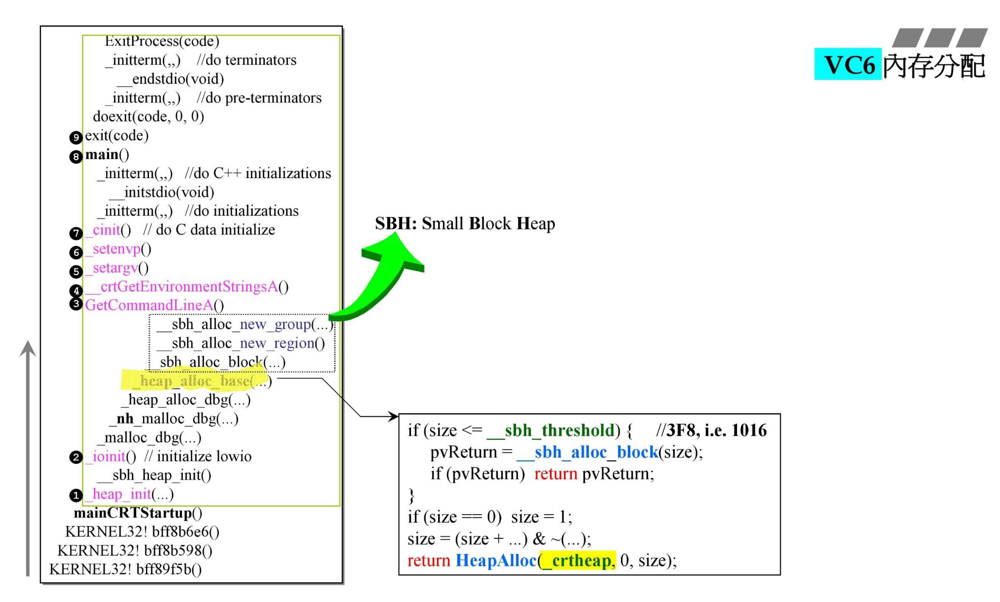

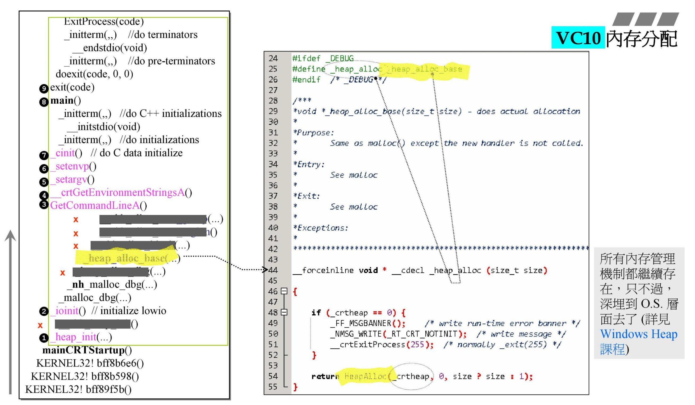

## vc6 malloc 分析

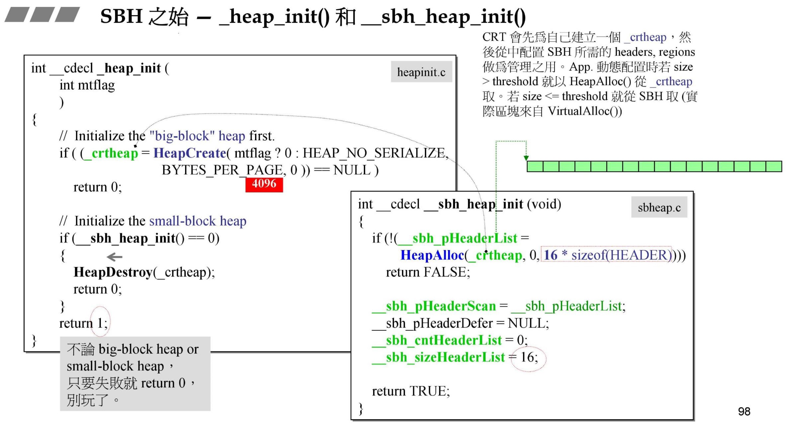

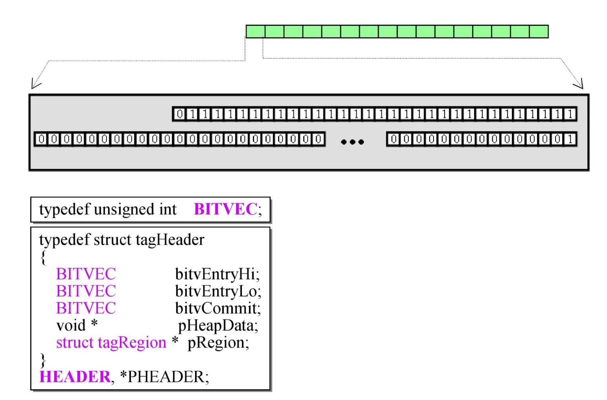

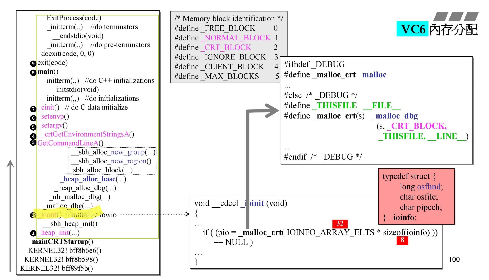

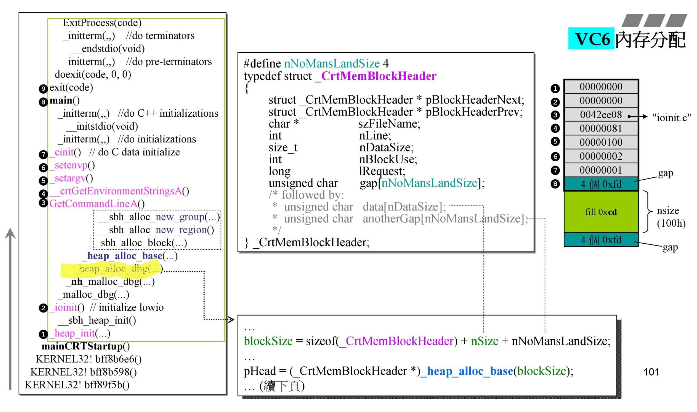

`CrtMemBlockHeader`--用于Debug的块结构，即为DEBUG header

1. 前向指针
2. 后向指针
3. 文件名
4. 行数
5. 块大小
6. 块使用类型标记，见本章最后一张图
7. 流水号
8. 前无人区
   
后续结构：

9.  数据块
10.  后无人区

前后无人区用于保护真正的数据块，调试的时候方便检测出使用越界！

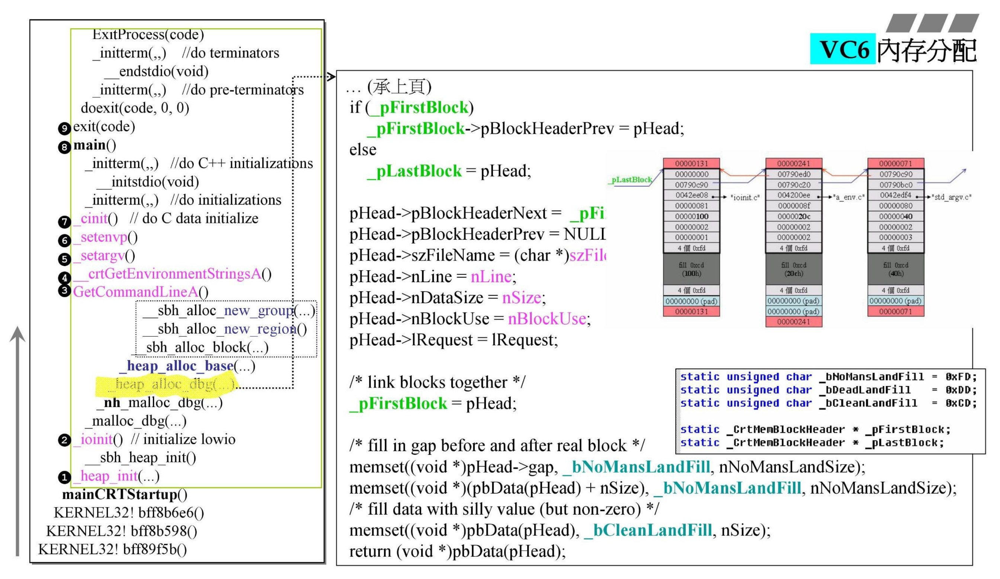

上下红色为cookie。

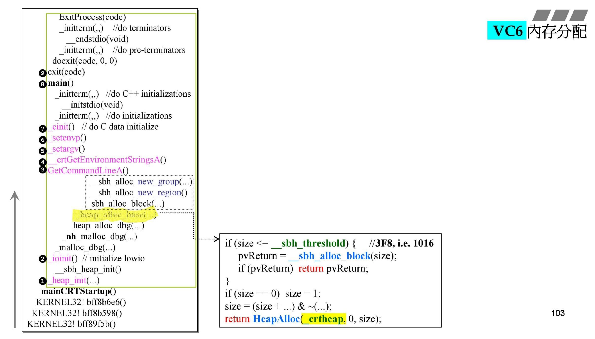

比1016而不比1024是因为还有8为cookie留的！

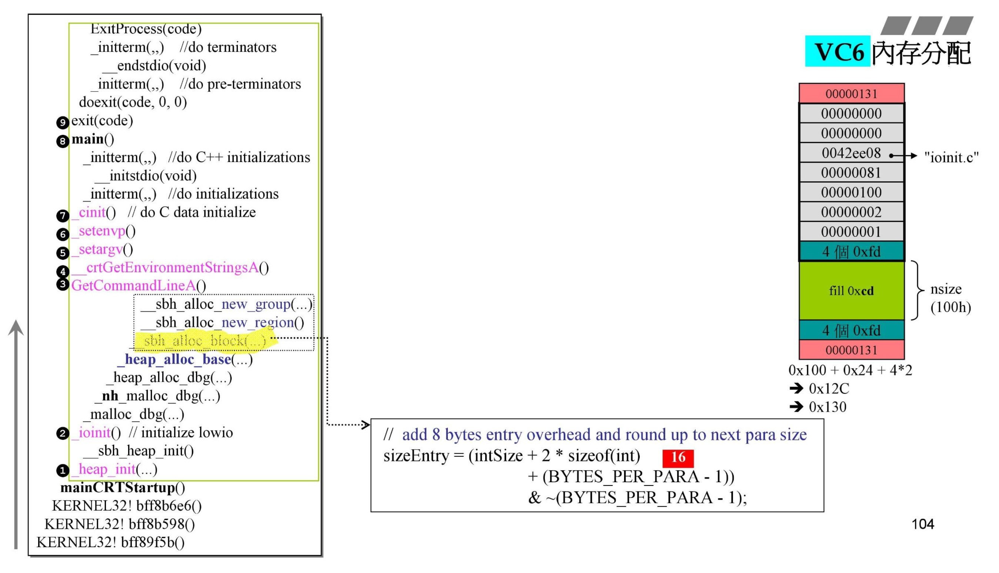

ROUNDUP(块大小+cookie)，向上取到16的倍数！

cookie借用最后一位的0、1表示该块是否分配！

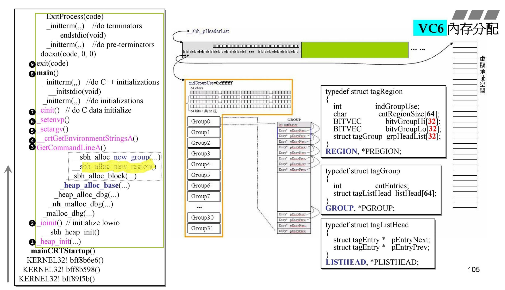

一个header可以管理1MB空间，成本约为16KB。

region是header中的管理结构：

`tagRegion`

BITVEC 共同组成一个32*64的位图，表示是否被使用。

`tagGroup`

管理实体，64组。

`tagListHead`

实体为list结构，需要前后指针。

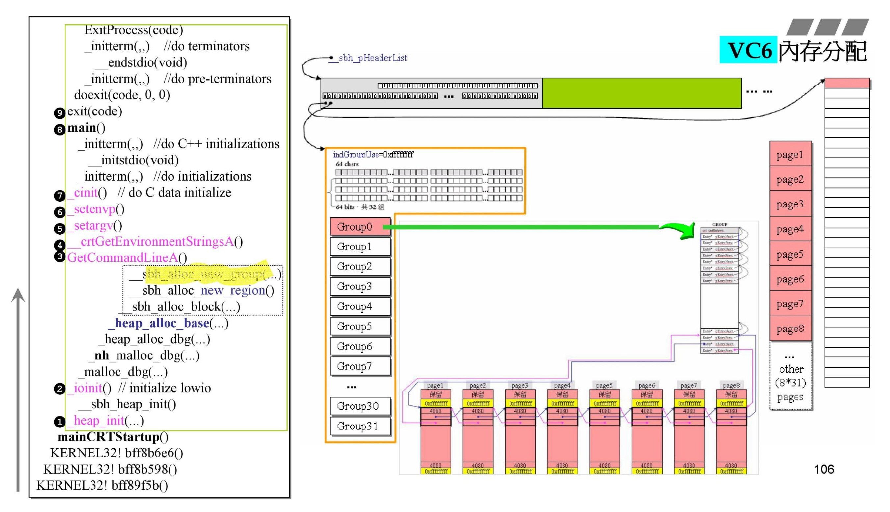

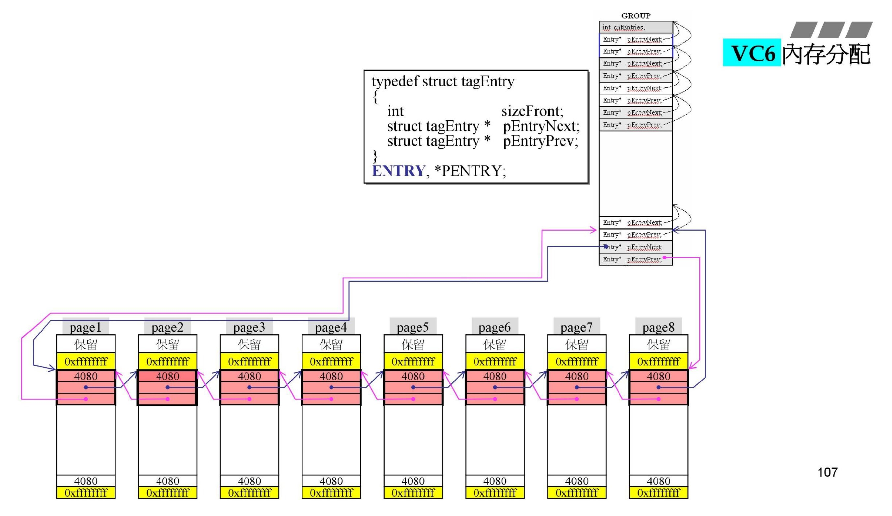

group是虚拟存储空间:

一个group对应8个page。

`tagEntry`

一个整数，两个指针。

此处利用了结构体三个元素都一样大特点，往前三格，实现了双向循环链表，从而节省了那个整数对内存空间的使用。炫技？

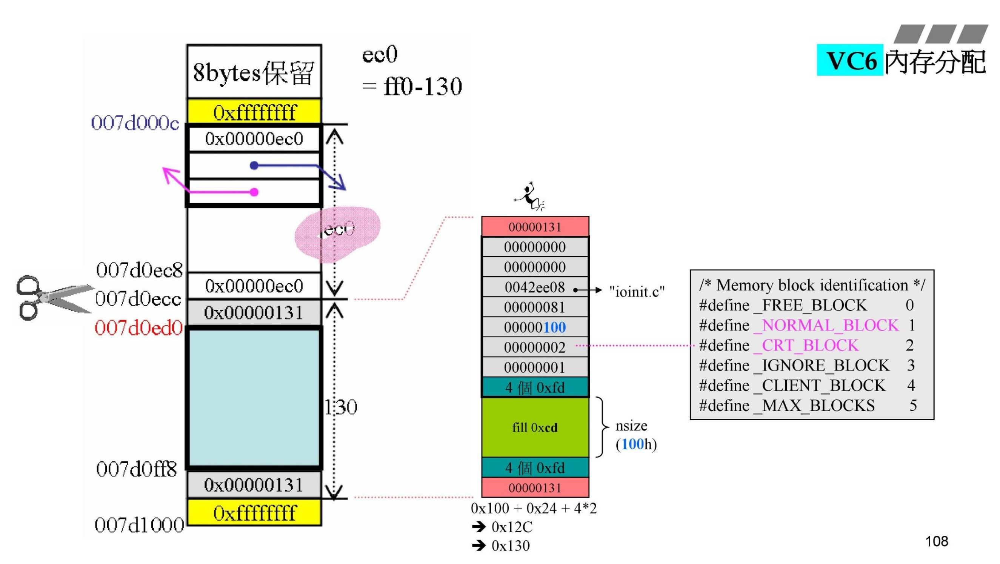

此处块使用类型中，NORMAL_BLOCK若在程序运行最后还有就是内存泄露，大概gdb就是这样来检测的吧。
