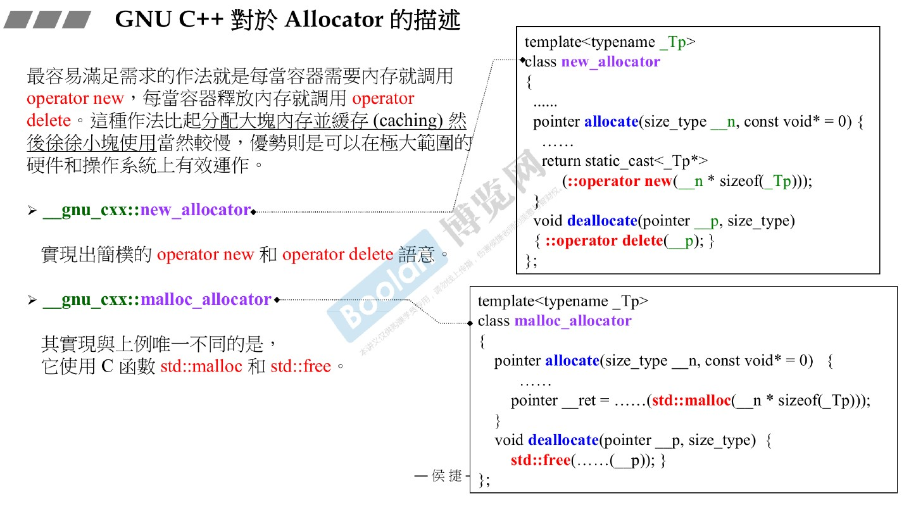
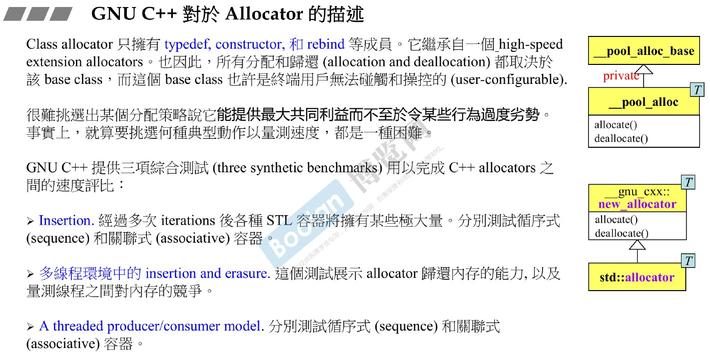
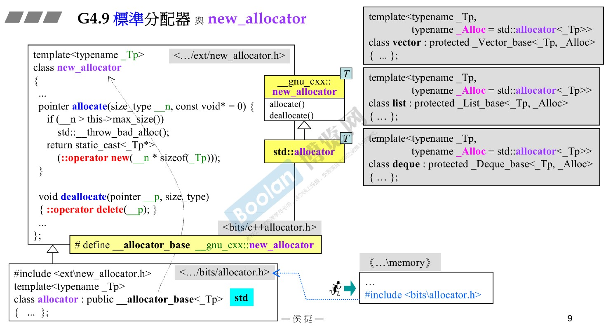
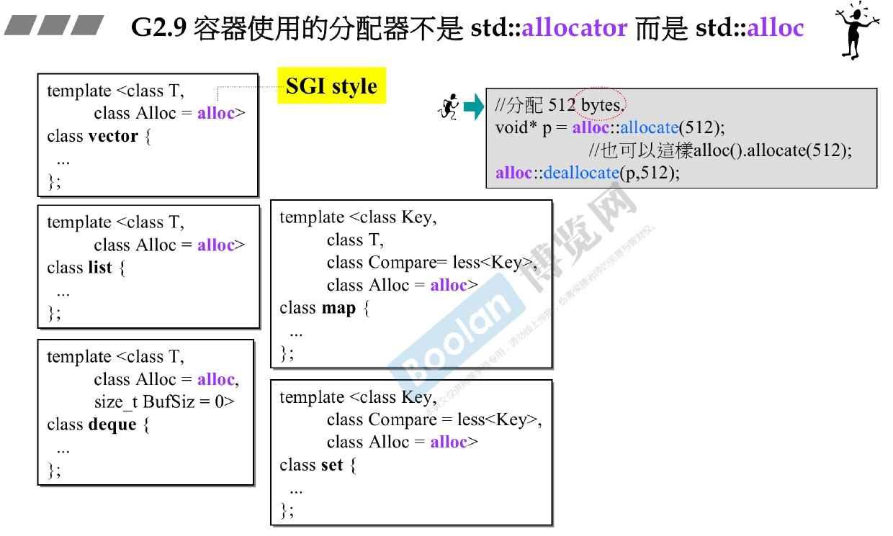
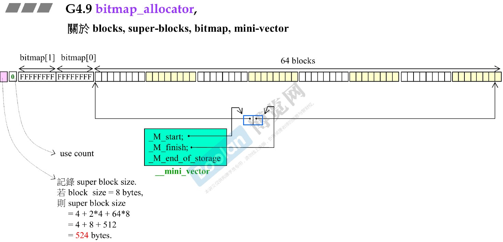
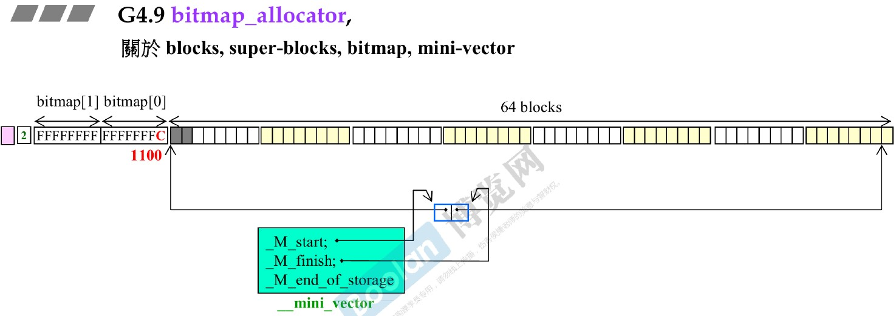
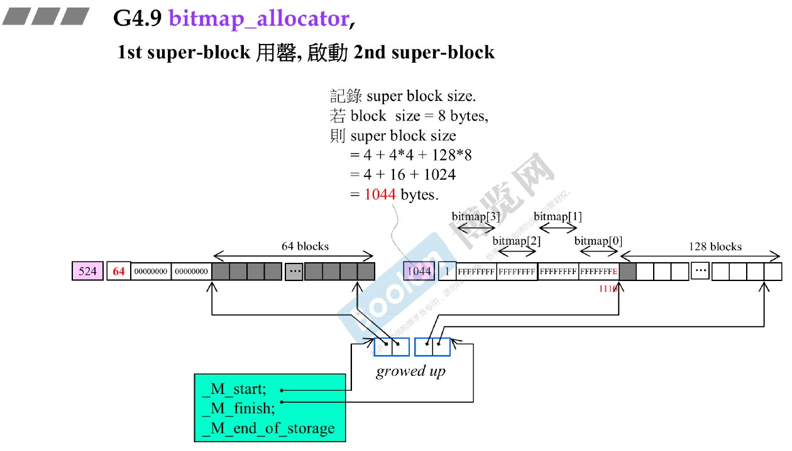
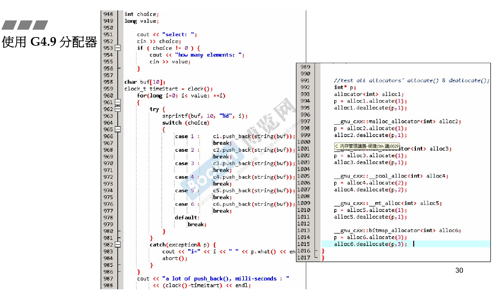

源自侯捷老师内存管理课程！

# allocator analyz

## GNC allocator

allocator诞生就是为了给容器使用，本质目的就是为了节省内存空间，去除malloc分配带来的cookie。部分allocator还是通过new/delete调用malloc/free。

智能型allocator，就是使用缓存思想构建内存池，供所有容器共享（应该是使用该分配器的，但是内存池不是容器构建的吗？全局静态allocator，大家共享！）。

GNC提供了三个评价allocator的性能指标：插入性能、多线程插入删除、单线程生产者消费者模型性能。

另外的allocator：
1. debug_allocator：为调用malloc/delete做一层封装;
2. array_allocator：对已有数组封装。

## vs2013 allocator

直接调用new/delete。

## GN4.9 allocator

### std_allocator

直接调用new/delete。

### malloc allocator

直接调用malloc/free。

### malloc array allocator

对数组进行封装，故不需要deallocate，allocate只是对已有空间分配及操作大小移动。

### debug allocator

模仿malloc中的debugheader加了一个大小模块，同时又采用结构体对齐思想。

### GN2.9 std_alloc

### pool_alloc

### bitmap allocator

bitmap_alloc：一个元素一个元素分配，多个元素就调用new/delete处理。
挖一大块，一个一个分配，标准内存池思想。

blocks：待分配的内存块。

super-blocks：内存块与位图、使用量、大小（内存块+位图+使用量）组成的内存空间管理集合。

bitmap：与每个块按位对应，从低位到高位表示从第一块到第n块是否使用。

mini-vector：管理内存池的vector，不使用标准是为了避免allocator权责不清，鸡生蛋还是蛋生鸡？

vector大小遵循正常的双倍扩充，内存块也是。

vector中Entries只属于某个固定类型，不可混用。

- 问题：这种设定是否增加了空间分配的代价？

不曾全回收就每次申请双倍扩充，全回收就减半！

内存回收问题：回收的块来到了另一个管理回收的vector，一旦超出entries阈值64，就自动归还最大的给os，这个vector是按空间大小从小到大排序的。

回收后的分配问题，优先从后向前分配，尽量不去申请新空间！

基本原则：尽量不新开辟空间，利用已有空间！

此处先拉哪个出来，遵循全回收规模缩减原则！
### use case

导入对应头文件，通过对应using namespace调用。