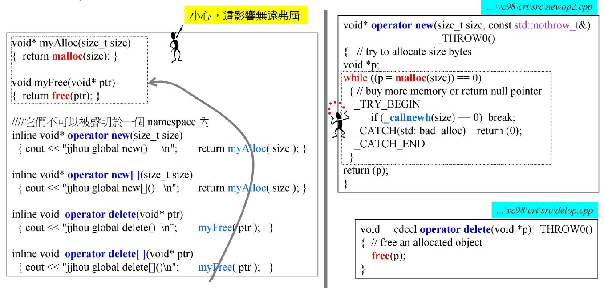
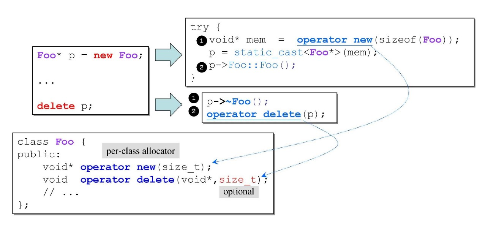
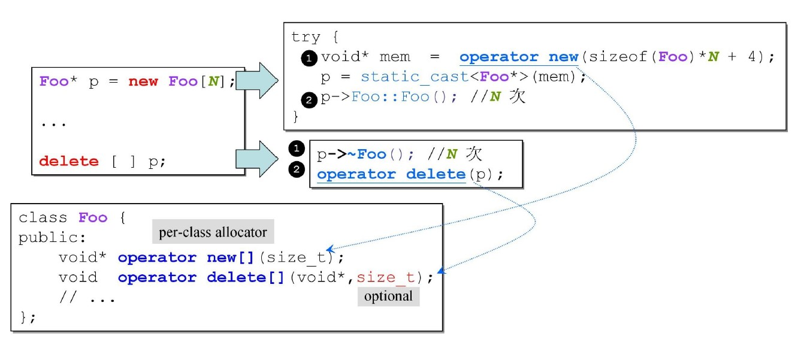
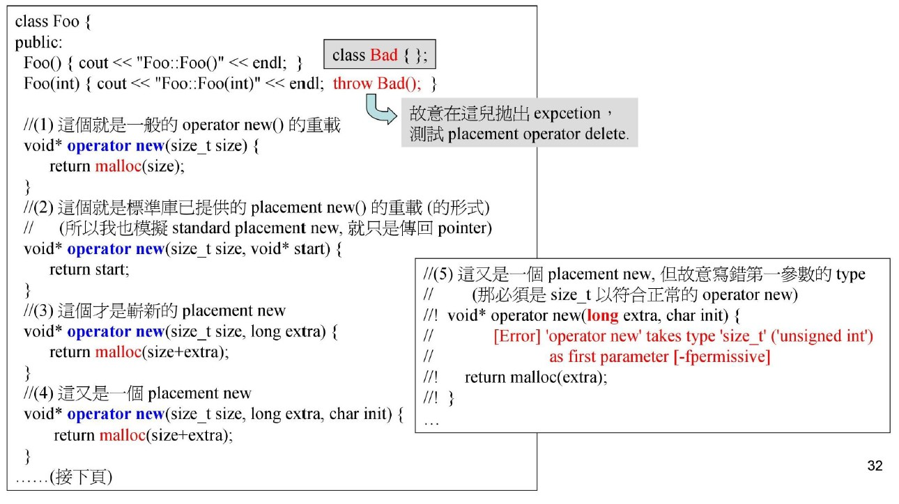
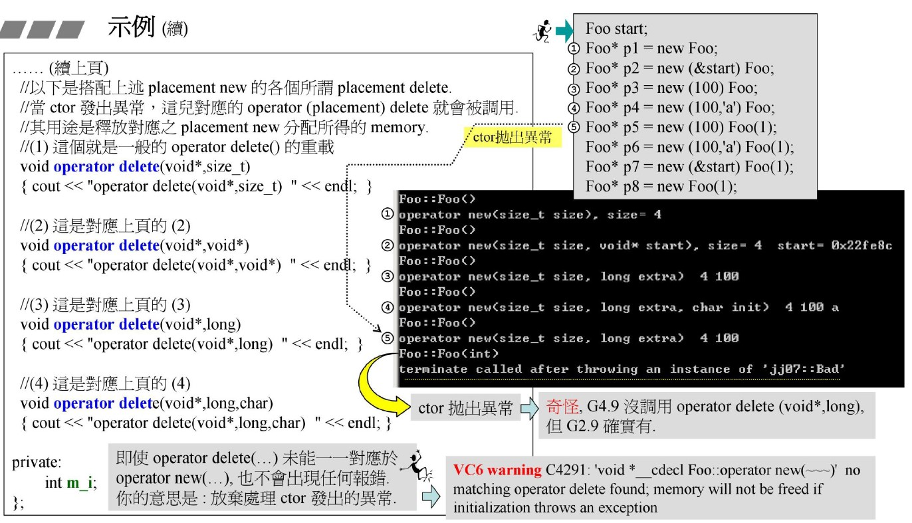
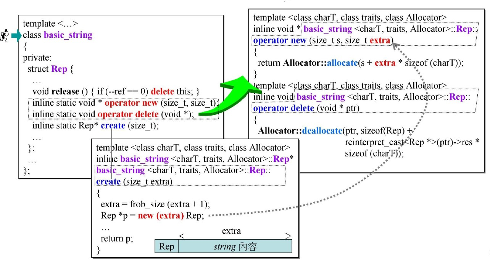

源自侯捷老师内存管理课程！

# 重载

由于之前提到的默认的c++ primitives在申请空间时需要额外的cookies，所以我们往往希望使用自己重载的版本。

## 重载::operator new()、::operator delete()

`::operator new()`和`::operator delete()`都是全局(真正的全局，不是局限于单个文件的全局)函数，不可以定义在某个namespace内。

重载后影响较大，因为会影响所有默认的new()、delete()，所以要十分注意。

## 重载operator new()、operator delete()

## 重载operator new[]、operator delete[]

## 重载placement new/delete即new()、delete()

正常来说对于placement new是不需要匹配的placement delete的，因为一般其没有空间分配操作。
但是我们重载的版本变为new()，先申请空间然后调用类constuctor做对象初始化，一但空间分配失败，需要对应的delete()，但是可以忽略（在vc6中会有警告提示）。

定义的`placement delete`或者确切的说`delete()`只有在new调用的constructor函数失败时才会被调用，至于具体会不会调用还要看编译器的处理。
猜测有的版本不调用是因为默认写法的空间分配是会做是否能成功申请到空间的判断的，若不能就直接释放，故不需要调用。

- 注

placement_new第一个参数必须是size_t类型。

### basic_string 重载的 new(extra)

